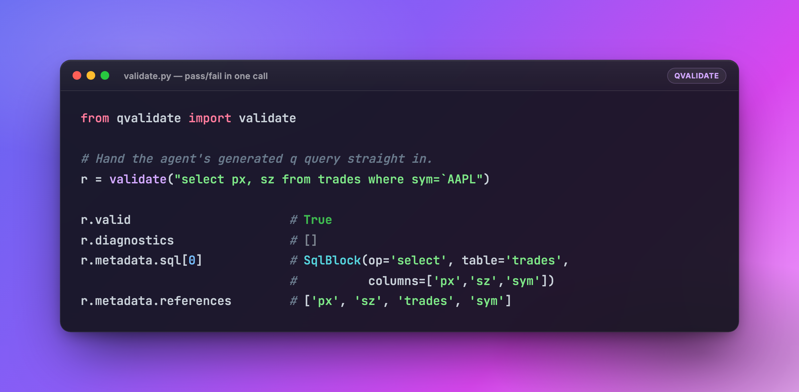
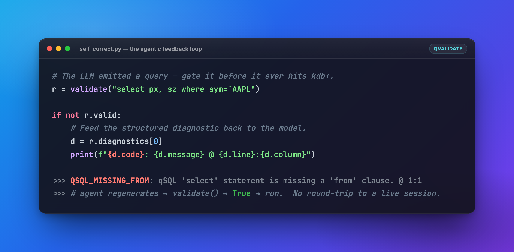
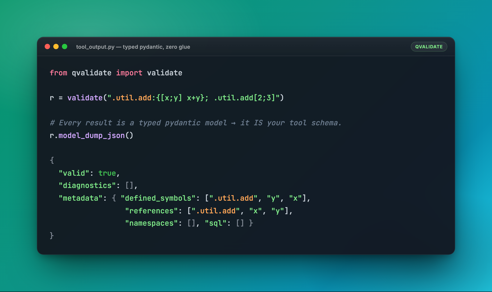

<div align="center">

# qvalidate

### Parse-time validation for LLM-generated **kdb/q** — built to be dropped straight into an agent's tool loop.

[](#install)
[](#install)
[](#tests)
[](https://docs.astral.sh/uv/)
[](https://docs.astral.sh/ruff/)
[](#license)

<br/>



</div>

---

## Why this exists

An agent turns *"show me the last trade price for AAPL"* into a full kdb/q
query. Before that string runs, **something has to decide whether it's even
parseable** — and the usual options are bad:

- **Run it and see.** A malformed query throws inside your live kdb+ session,
  pollutes state, and burns a round-trip just to learn it had an unbalanced
  brace.
- **Ask another LLM.** Slow, non-deterministic, and it hallucinates errors that
  block perfectly good queries.

`qvalidate` is the missing third option: a **pure-Python, sub-millisecond,
zero-dependency** gate that tells you *exactly* what `q` itself would reject at
parse time — and hands back structured metadata the agent can reason over. The
lexer, parser and scope analysis are a faithful port of the
[kx-vscode](https://github.com/KxSystems/kx-vscode) language server's q core
(Chevrotain multi-mode lexer + single-pass scope/assignment/namespace analysis),
so its verdicts match the editor your kdb+ engineers already trust.

> **No kdb+ runtime. No network. No API key. No model.** Just `validate(str)`.

---

## Plug-and-play for agents

`qvalidate` is designed to sit in exactly one place: **between the model's output
and your execution layer.** Three ways teams wire it in.

### 1 · Gate-and-self-correct loop

Catch the failure, feed the *structured* diagnostic back to the model, let it
fix its own query — all before a single byte reaches kdb+.

<div align="center"></div>

```python
from qvalidate import validate

def safe_q(generate, prompt, max_tries=3):
    """Ask the model for a query; only return one q would actually parse."""
    for _ in range(max_tries):
        query = generate(prompt)
        r = validate(query)
        if r.valid:
            return query                       # ✅ safe to execute
        # Hand the model a precise, machine-readable reason to retry.
        d = r.diagnostics[0]
        prompt += f"\n\n# Previous query failed: {d.code} — {d.message} at {d.line}:{d.column}. Fix it."
    raise ValueError("model could not produce a parseable query")
```

### 2 · Tool-call validator

Every result is a typed [pydantic](https://docs.pydantic.dev) model, so
`.model_dump_json()` gives you a JSON-ready payload you can return verbatim from
a tool / function call — and the model itself doubles as the schema for the
LLM's tool definition. No glue code, no custom serializer.

<div align="center"></div>

```python
from qvalidate import validate

def validate_q_tool(query: str) -> str:
    """An MCP / function-calling tool the model can invoke directly."""
    return validate(query).model_dump_json()
```

### 3 · Static guardrail in a pipeline

Reject obviously-broken queries *before* they enter an expensive RAG / planning
chain — `validate()` is fast enough to call on every candidate without thinking
about it.

```python
candidates = [q for q in model_outputs if validate(q).valid]
```

---

## What it flags

Only **parse-time failures** — the things `q` itself rejects when parsing:

| Code | Meaning |
|------|---------|
| `UNBALANCED_PAREN` / `UNBALANCED_BRACKET` / `UNBALANCED_BRACE` | An opener with no matching closer |
| `UNEXPECTED_CLOSE` | A closer with no matching opener |
| `MISMATCHED_DELIMITER` | `)` closing a `[`, etc. |
| `UNCLOSED_STRING` | Unterminated string literal |
| `INVALID_ESCAPE` | Bad string escape (valid: `\n \r \t \\ \/ \"` and octal `\100`–`\377`) |
| `LEX_ERROR` | A character that cannot be lexed |
| `QSQL_MISSING_FROM` | A `select` / `exec` with no `from` clause |

### What it deliberately does **not** flag

To avoid false positives that would needlessly block the agent:

- Unknown identifiers / globals (we don't know the live session namespace).
- Unknown table or column names (no schema information).
- Anything stylistic (unused vars/params, deprecation, formatting).

---

## Install

```bash
uv add qvalidate          # or:  pip install qvalidate
```

One runtime dependency ([pydantic](https://docs.pydantic.dev) v2). Python 3.9+.

## Usage

```python
from qvalidate import validate

r = validate("select px, sz from trades where sym=`AAPL")

r.valid                       # True
r.diagnostics                 # []  (list[Diagnostic] otherwise)
r.metadata.defined_symbols    # symbols the query assigns
r.metadata.references         # identifiers the query uses   → ['px','sz','trades','sym']
r.metadata.namespaces         # e.g. ['.util']
r.metadata.sql                # [SqlBlock(op='select', table='trades',
                              #           columns=['px','sz','sym'])]
```

Every result is a fully-typed **pydantic** model — `ValidationResult`,
`Diagnostic`, `QueryMetadata`, `SqlBlock` — so you get IDE autocomplete,
validation, and serialisation for free:

```python
r.model_dump()                # → dict
r.model_dump_json()           # → JSON string  (ideal tool-call output)
ValidationResult.model_validate_json(payload)   # ← parse straight back
```

Lower-level building blocks are exported too: `tokenize(text)` and
`Source.create(uri, text)`.

---

## Tests

This is a [uv](https://docs.astral.sh/uv/) project. Sync the environment and run
the suite (coverage is enforced at **≥80%** via `--cov-fail-under`):

```bash
uv sync --extra test
uv run pytest
```

The optional **oracle** suite (`tests/test_oracle.py`) cross-checks every corpus
query against a real q parser via `pykx` — the authoritative guard that we never
reject a query q would accept. It is skipped automatically when `pykx` (and a
kdb+ runtime) is unavailable:

```bash
uv sync --extra oracle
uv run pytest tests/test_oracle.py
```

### Lint & type-check

```bash
uv run ruff check        # style + unused-import lint
uv run ty check          # static type analysis
```

### Commit hooks

[`prek`](https://prek.j178.dev) runs `ruff format` and `ty check` on the Python
files staged in each commit (config in [`prek.toml`](prek.toml)) — using the
project's uv environment without ever syncing or installing:

```bash
prek install             # wire up the git pre-commit hook
prek run --all-files     # run the hooks on demand
```

---

## Performance

Validation is a per-token `re.match` loop over a short string — sub-millisecond
in pure Python. Reference resolution is dict-indexed (O(n)). If batch throughput
ever matters, only `lexer.py` need be swapped for a Rust core (e.g. `logos` via
PyO3) behind this same API.

## License

[Apache-2.0](LICENSE.md) (matching the ported kx-vscode sources).
